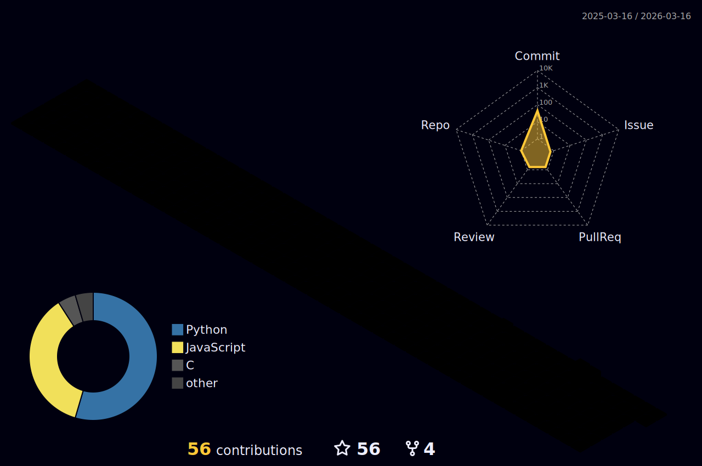

  

  
  
  

## Hi I'm John 👋

I've been living and breathing programming since I was 15 (26 now). I mostly specialize in Cyber Security, Distributed Computing, and Full Stack development these days. I have a bit of an obsession for linux, containers, and kubernetes (it is a problem).

- Senior Software Engineer at [VolaDynamics](https://voladynamics.com)
- Creator of the [Anubis Learning Mangement System](https://github.com/AnubisLMS) (with a [blog](https://anubis-lms.io/blog))
- Former President of the [OSIRIS Cyber Security Research Lab](https://www.osiris.cyber.nyu.edu)
- Former Infrastructure Manager of the [OSIRIS Cyber Security Research Lab](https://www.osiris.cyber.nyu.edu)

My Vola Dynamics gitlab profile: [https://gitlab.com/john.cunniff](https://gitlab.com/john.cunniff)

# Some stats

# Some projects

